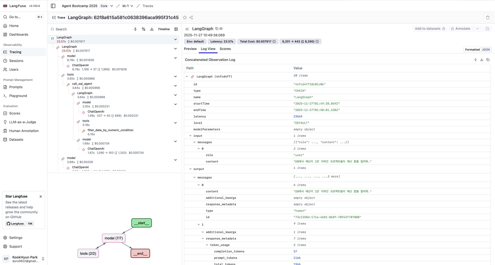
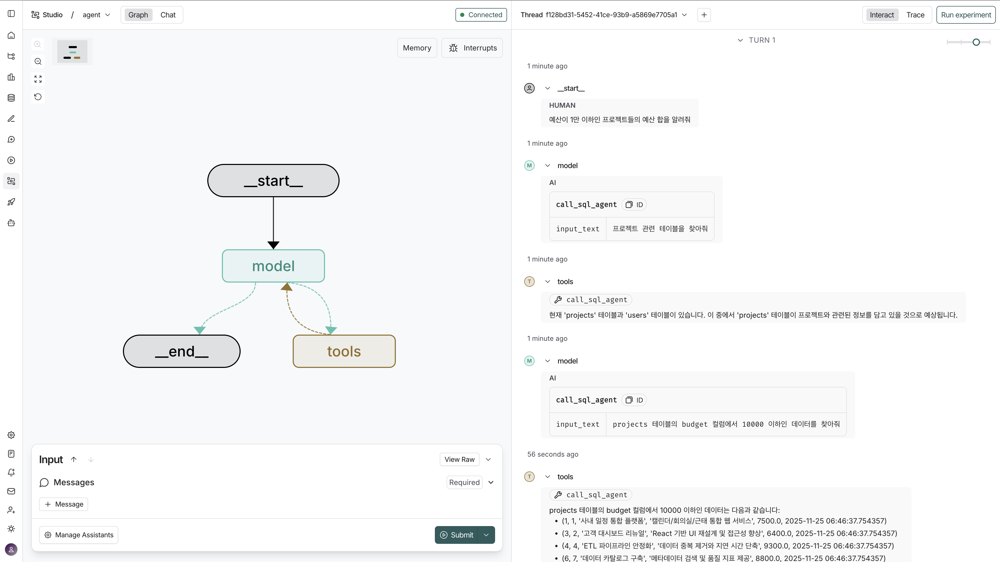
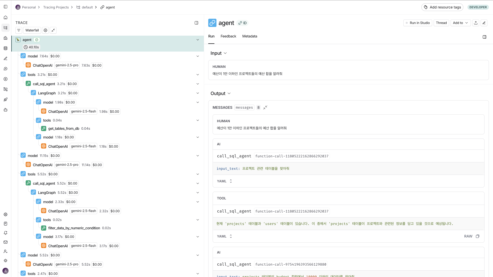
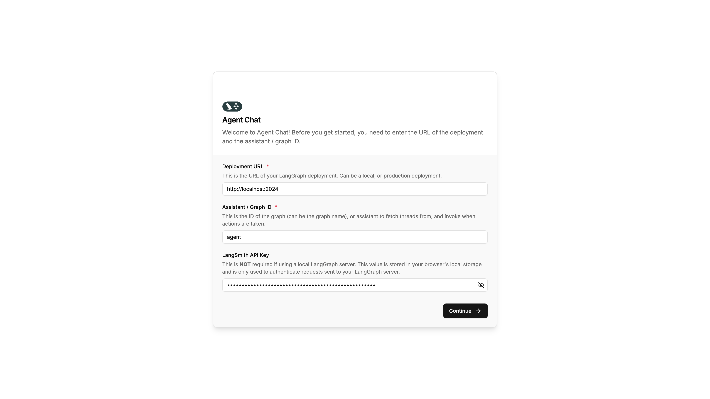
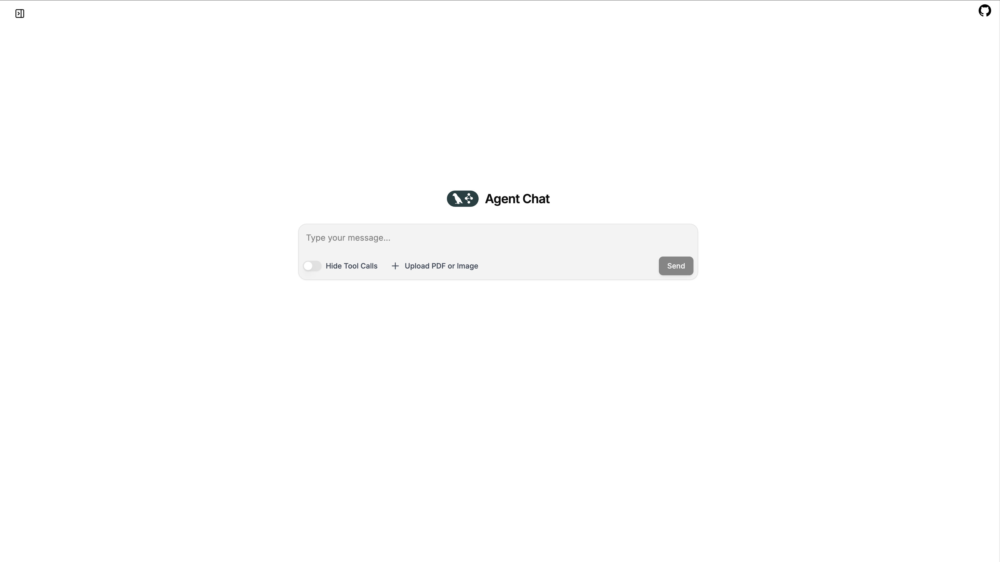
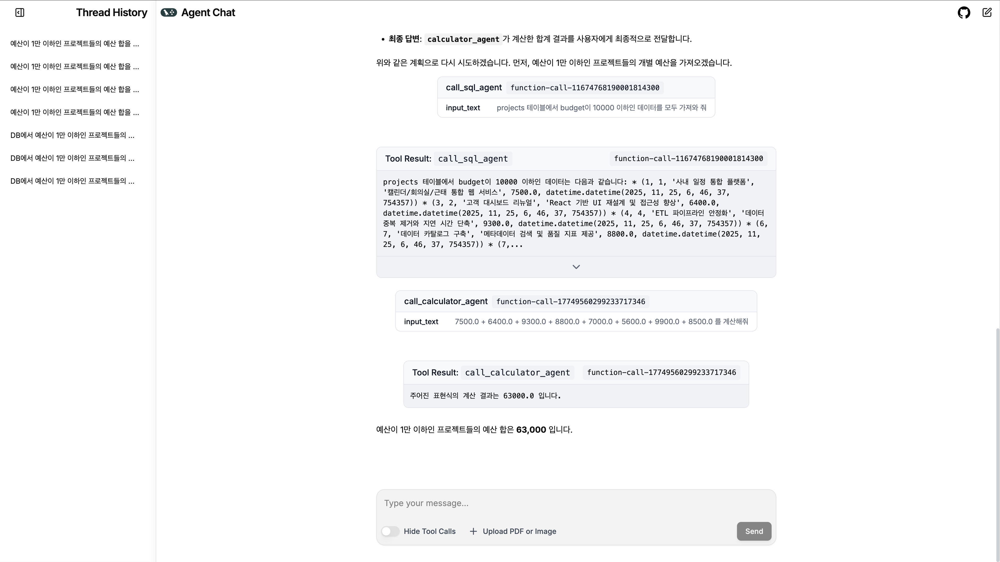

# Vector Institute Agent

## 환경변수 설정

`.env.example` 파일을 복사하여 `.env` 파일을 생성하고 필요한 환경변수를 설정하세요.

```bash
cp .env.example .env
```

설정해야 할 환경변수는 다음과 같습니다:

- 모델 관련
  - `OPENAI_BASE_URL`: OpenAI API의 기본 URL
  - `OPENAI_API_KEY`: OpenAI API 키
- 웹 검색 관련
  - `SERPAPI_API_KEY`: SerpAPI 키
- LangSmith 관련
  - `LANGSMITH_API_KEY`: LangSmith API 키
- LangFuse 관련
  - `LANGFUSE_SECRET_KEY`: LangFuse 비밀 키
  - `LANGFUSE_PUBLIC_KEY`: LangFuse 공개 키
  - `LANGFUSE_HOST`: LangFuse 호스트 URL

## Python 가상환경 설정

이 프로젝트는 `uv`를 사용하여 가상환경을 관리합니다. 없다면 다음 명령어로 `uv`를 설치하세요.

```bash
pip install uv
```

가상환경을 생성하고 활성화하려면 다음 명령어를 실행하세요.

```bash
uv sync
```

## SQLite 데이터베이스 설정

다음 명령어를 실행하면 DB가 생성되고 가짜 데이터가 시드됩니다.

```bash
python db/init_db.py
```

`db/data.db` 파일이 프로젝트 루트에 생성됩니다.

스키마는 두 개의 테이블을 포함합니다:

- `users(id, name, email, age, created_at)`
- `projects(id, user_id, title, description, budget, created_at)`

## 에이전트 실행

환경 준비 후 아래 명령을 실행하세요.

```bash
python main.py
```

실행 결과 예시

```text
================================== Ai Message ==================================
Tool Calls:
  call_sql_agent (function-call-11894917129289076080)
 Call ID: function-call-11894917129289076080
  Args:
    input_text: 예산이 1만 이하인 프로젝트들의 예산 합을 알려줘
================================= Tool Message =================================
Name: call_sql_agent

주어진 정보에 따르면 예산이 1만 이하인 프로젝트들을 필터링할 수는 있지만, 필터링된 프로젝트들의 예산 합을 직접적으로 계산하는 기능은 제공되지 않습니다.

만약 예산이 1만 이하인 프로젝트들의 목록을 원하시면 해당 정보를 찾아드릴 수 있습니다.
================================== Ai Message ==================================

예산이 1만 이하인 프로젝트들의 예산 목록을 알려주세요. 이 정보를 바탕으로 제가 합계를 계산해 드리겠습니다.
Tool Calls:
  call_sql_agent (function-call-3649536677768337015)
 Call ID: function-call-3649536677768337015
  Args:
    input_text: 예산이 1만 이하인 프로젝트들의 예산 목록을 알려줘
================================= Tool Message =================================
Name: call_sql_agent

예산이 1만 이하인 프로젝트들의 예산 목록입니다:

*   **사내 일정 통합 플랫폼**: 7500.0
*   **고객 대시보드 리뉴얼**: 6400.0
*   **ETL 파이프라인 안정화**: 9300.0
*   **데이터 카탈로그 구축**: 8800.0
*   **오브저버빌리티 개선**: 7000.0
*   **AB 테스트 자동화**: 5600.0
*   **데이터 레이크 비용 최적화**: 9900.0
*   **CI/CD 파이프라인 병렬화**: 8500.0
================================== Ai Message ==================================
Tool Calls:
  call_calculator_agent (function-call-12988403354602122390)
 Call ID: function-call-12988403354602122390
  Args:
    input_text: 7500.0 + 6400.0 + 9300.0 + 8800.0 + 7000.0 + 5600.0 + 9900.0 + 8500.0 계산해줘
================================= Tool Message =================================
Name: call_calculator_agent

제공된 모든 숫자의 합은 63000.0 입니다.
================================== Ai Message ==================================

예산이 1만 이하인 프로젝트들의 예산 합은 63,000입니다.

각 프로젝트의 예산은 다음과 같습니다.
*   사내 일정 통합 플랫폼: 7,500
*   고객 대시보드 리뉴얼: 6,400
*   ETL 파이프라인 안정화: 9,300
*   데이터 카탈로그 구축: 8,800
*   오브저버빌리티 개선: 7,000
*   AB 테스트 자동화: 5,600
*   데이터 레이크 비용 최적화: 9,900
*   CI/CD 파이프라인 병렬화: 8,500
```

## LangFuse로 대화 내용 로깅

LangFuse API Key를 설정했다면 에이전트의 대화 내용이 LangFuse에 자동으로 로깅됩니다.



## UI로 대화 흐름 시각화

LangSmith API Key를 설정했다면 에이전트의 대화 흐름과 툴 호출을 시각적으로 확인할 수 있습니다.

```bash
langgraph dev --tunnel
```

## Interaction을 확인하는 화면



## Trace를 확인하는 화면



> LangChain의 ChatUI

[Agent Chat](https://agentchat.vercel.app/)으로 접근 후 내용 입력하면 대화형 UI로도 에이전트를 사용할 수 있습니다.




