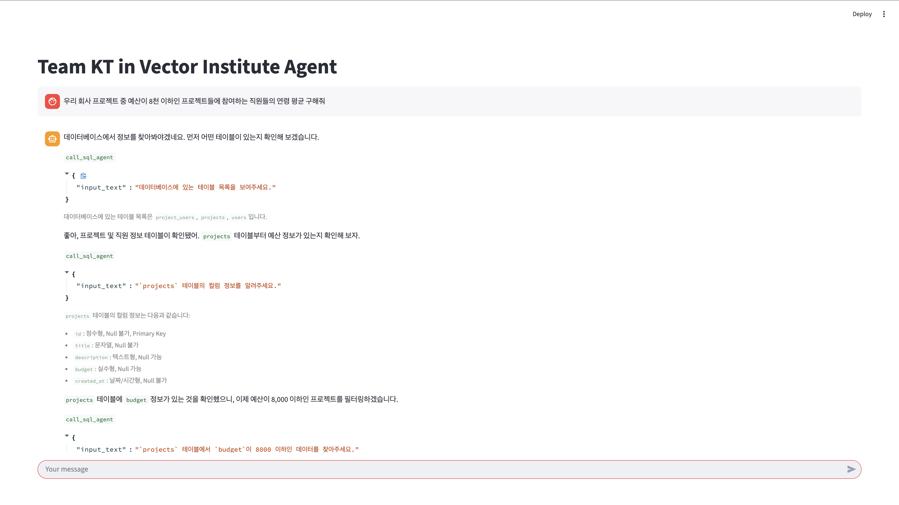
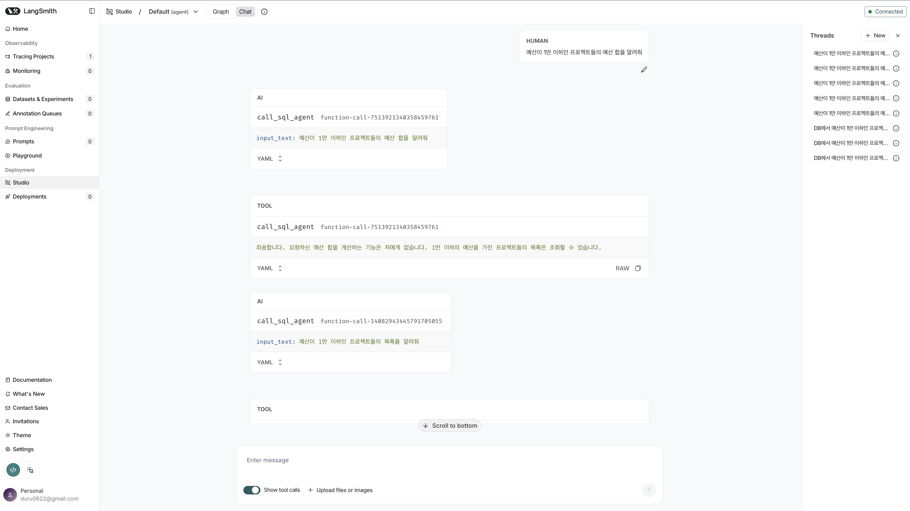

# Vector Institute Agent

## 환경변수 설정

`.env.example` 파일을 복사하여 `.env` 파일을 생성하고 필요한 환경변수를 설정하세요.

```bash
cp .env.example .env
```

설정해야 할 환경변수는 다음과 같습니다:

- 모델 관련
  - `OPENAI_BASE_URL`: OpenAI API의 기본 URL
  - `OPENAI_API_KEY`: OpenAI API 키
- 웹 검색 관련
  - `SERPAPI_API_KEY`: SerpAPI 키
- LangSmith 관련
  - `LANGSMITH_TRACING`: LangSmith 추적 활성화 여부 (true|false)
  - `LANGSMITH_API_KEY`: LangSmith API 키
- LangFuse 관련
  - `LANGFUSE_SECRET_KEY`: LangFuse 비밀 키
  - `LANGFUSE_PUBLIC_KEY`: LangFuse 공개 키
  - `LANGFUSE_HOST`: LangFuse 호스트 URL

## Python 가상환경 설정

이 프로젝트는 `uv`를 사용하여 가상환경을 관리합니다. 없다면 다음 명령어로 `uv`를 설치하세요.

```bash
pip install uv
```

가상환경을 생성하고 활성화하려면 다음 명령어를 실행하세요.

```bash
uv sync
source .venv/bin/activate
```

## SQLite 데이터베이스 설정

다음 명령어를 실행하면 DB가 생성되고 가짜 데이터가 시드됩니다.

```bash
python -m db.init_db
```

`db/data.db` 파일이 프로젝트 루트에 생성됩니다.

스키마는 아홉 개의 테이블이 포함되어 있습니다.

- `departments`: 부서명, 위치, 생성일
- `employees`: 이름, 이메일(유니크), 직함, 부서 FK, 생성일
- `products`: 제품명(유니크), 카테고리, 가격, 과금주기, 생성일
- `clients`: 고객사명(유니크), 산업군, 도시, 생성일
- `contracts`: 고객 FK, 제품 FK, 영업 담당자 FK, 금액, 계약기간, 상태, 생성일
- `invoices`: 계약 FK, 청구/지불 금액, 결제수단, 생성일
- `projects`: 이름, 고객 FK, 제품 FK, 프로젝트 오너 FK, 단계(PoC/Pilot/Production), 생성일
- `meetings`: 고객 FK, 주최자 FK, 주제, 생성일
- `project_assignments`: 프로젝트 FK, 직원 FK, 역할, 생성일

## 에이전트 실행

환경 준비 후 아래 명령을 실행하세요.

```bash
python -m test.test_main_agent
```

> 실행 결과 예시

```text
질문을 입력하세요: 메시와 호날두의 라리가 한 시즌 최다 골 수의 차이가 얼마야?
================================== Ai Message ==================================
Tool Calls:
  call_web_agent (function-call-2218937160780267494)
 Call ID: function-call-2218937160780267494
  Args:
    input_text: 메시 라리가 한 시즌 최다 골
  call_web_agent (function-call-2218937160780267321)
 Call ID: function-call-2218937160780267321
  Args:
    input_text: 호날두 라리가 한 시즌 최다 골
================================= Tool Message =================================
Name: call_web_agent

메시는 2011-12 시즌에 라리가에서 50골을 득점하여 한 시즌 최다 골 기록을 세웠습니다.
================================= Tool Message =================================
Name: call_web_agent

호날두의 라리가 한 시즌 최다 골 기록은 **48골**로, **2014-2015 시즌**에 달성했습니다.
================================== Ai Message ==================================
Tool Calls:
  call_calculator_agent (function-call-596742620571668837)
 Call ID: function-call-596742620571668837
  Args:
    input_text: 50-48
================================= Tool Message =================================
Name: call_calculator_agent

50-48의 결과는 2입니다.
================================== Ai Message ==================================

메시와 호날두의 라리가 한 시즌 최다 골 기록의 차이는 2골입니다.

*   **메시:** 2011-12 시즌 50골
*   **호날두:** 2014-15 시즌 48골
```

## Streamlit 웹페이지 실행

다음 명령어로 Streamlit 웹페이지를 실행하세요.

```bash
streamlit run main.py
```



## LangFuse로 대화 내용 로깅

LangFuse API Key를 설정했다면 에이전트의 대화 내용이 LangFuse에 자동으로 로깅됩니다.


## LangSmith로 대화 흐름 시각화

LangSmith API Key를 설정했다면 에이전트의 대화 흐름과 툴 호출을 시각적으로 확인할 수 있습니다.

```bash
langgraph dev --tunnel
```

### Interaction을 확인하는 화면




### Trace를 확인하는 화면


> LangChain의 ChatUI [공식문서 링크](https://docs.langchain.com/oss/python/langchain/ui)

[Agent Chat](https://agentchat.vercel.app/)으로 접근 후 내용 입력하면 대화형 UI로도 에이전트를 사용할 수 있습니다.


