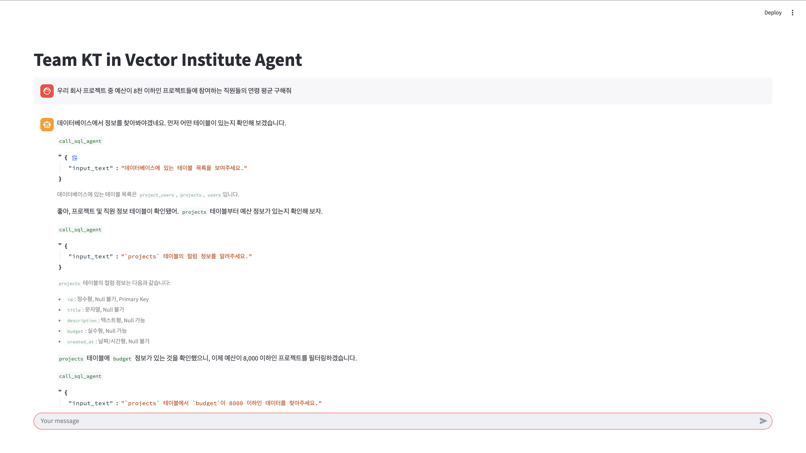
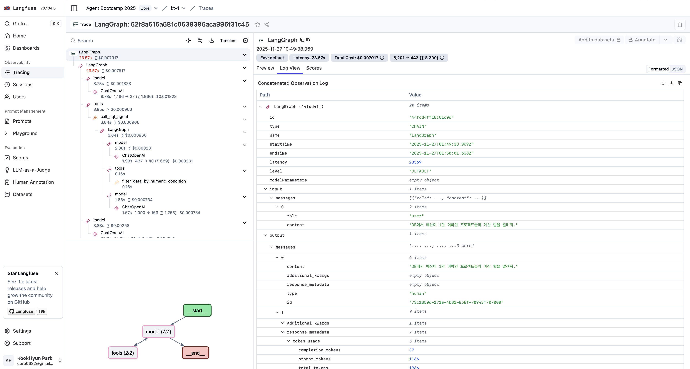
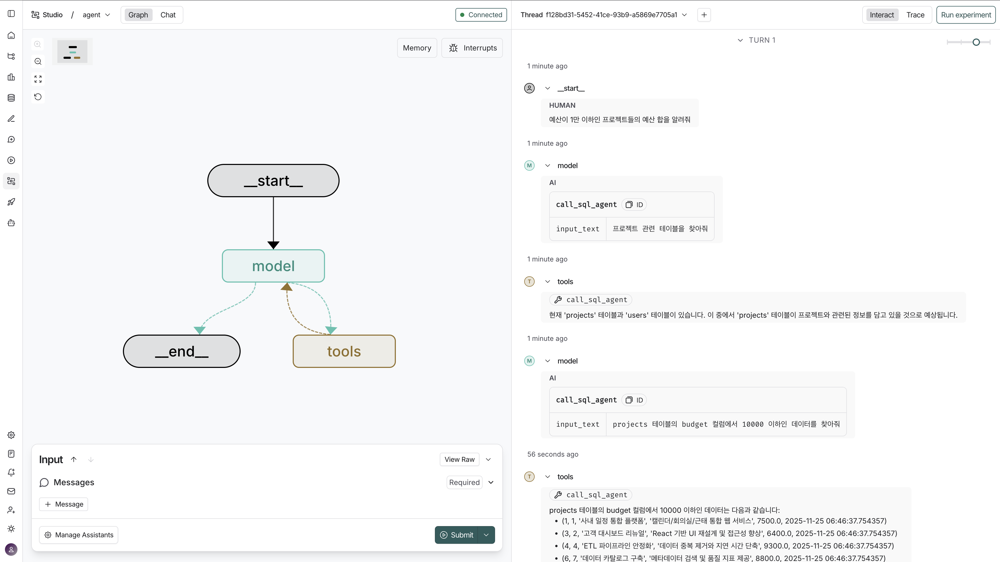
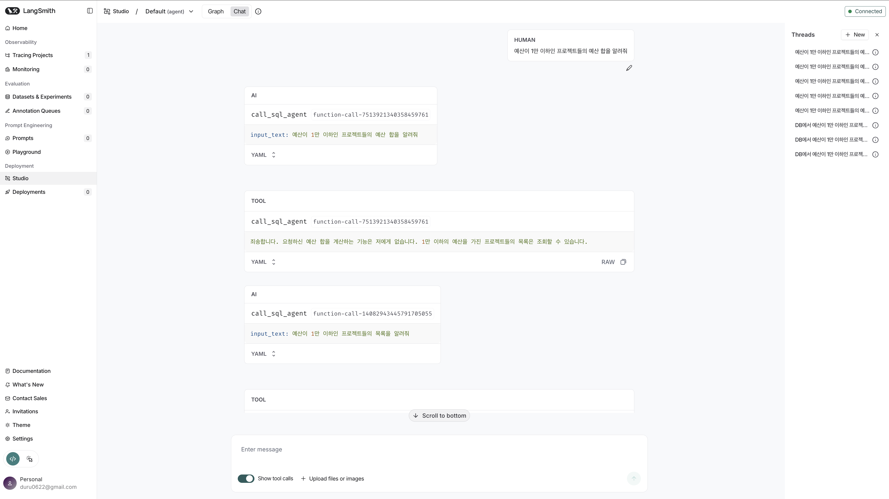
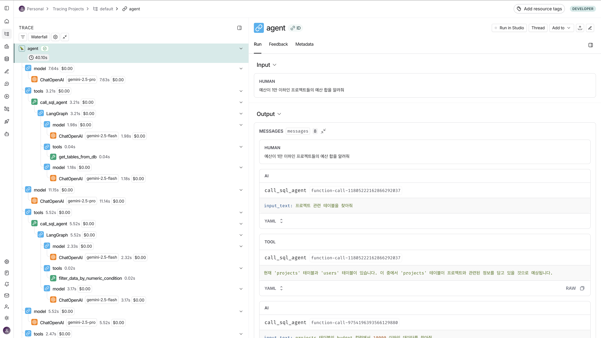
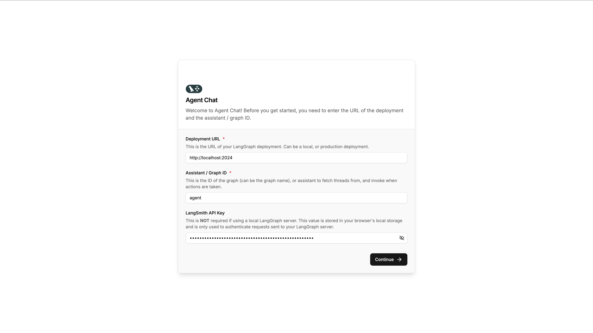
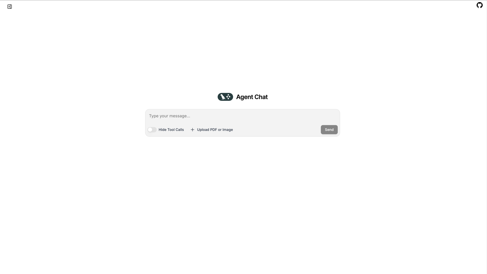
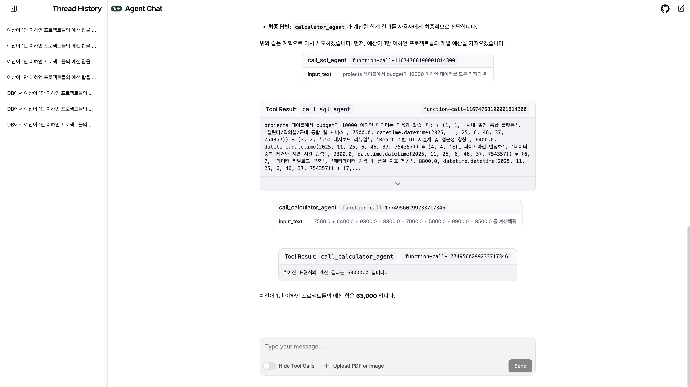

# Vector Institute Agent

## 환경변수 설정

`.env.example` 파일을 복사하여 `.env` 파일을 생성하고 필요한 환경변수를 설정하세요.

```shell
cp .env.example .env
```

설정해야 할 환경변수는 다음과 같습니다:

- 모델 관련
  - `OPENAI_BASE_URL`: OpenAI API의 기본 URL
  - `OPENAI_API_KEY`: OpenAI API 키
- 웹 검색 관련
  - `SERPAPI_API_KEY`: SerpAPI 키
- LangSmith 관련
  - `LANGSMITH_TRACING`: LangSmith 추적 활성화 여부 (true|false)
  - `LANGSMITH_API_KEY`: LangSmith API 키
- LangFuse 관련
  - `LANGFUSE_SECRET_KEY`: LangFuse 비밀 키
  - `LANGFUSE_PUBLIC_KEY`: LangFuse 공개 키
  - `LANGFUSE_HOST`: LangFuse 호스트 URL

## Python 가상환경 설정

이 프로젝트는 `uv`를 사용하여 가상환경을 관리합니다. 없다면 다음 명령어로 `uv`를 설치하세요.

```shell
pip install uv
```

가상환경을 생성하고 활성화하려면 다음 명령어를 실행하세요.

```shell
uv sync
source .venv/bin/activate
```

## SQLite 데이터베이스 설정

다음 명령어를 실행하면 DB가 생성되고 가짜 데이터가 시드됩니다.

```shell
uv run python -m db
```

`db/movie.db` 파일이 프로젝트 루트에 생성됩니다.

스키마는 아홉 개의 테이블이 포함되어 있습니다.

- `Movies`: 영화 정보가 담긴 데이터
- `People`: 감독, 배우, 스태프 등의 정보가 담긴 데이터
- `Experts`: 평론가들 정보가 담긴 데이터
- `MoviePeople`: 영화와 감독, 배우, 스태프 등이 연결되어 있는 테이블
- `MovieExperts`: 영화와 평론이 연결되어있는 테이블

## 에이전트 실행

환경 준비 후 아래 명령을 실행하세요.

```shell
uv run python -m test.test_main_agent
```

<details>
  <summary>실행 결과 예시</summary>

```text
사용자 질문을 입력하세요: 괴물의 감독의 최근 작품이 뭐야
================================ Human Message =================================

괴물의 감독의 최근 작품이 뭐야
================================== Ai Message ==================================
Tool Calls:
plan_recorder (function-call-5961987744816933422)
Call ID: function-call-5961987744816933422
Args:
  plan: 1. SQL 에이전트를 사용하여 영화 '괴물'의 감독 정보를 조회합니다.
2. 웹 에이전트를 사용하여 조회된 감독의 최근 작품을 검색합니다.
3. 검색된 정보를 종합하여 사용자의 질문에 답변합니다.
================================= Tool Message =================================
Name: plan_recorder

계획이 기록되었습니다. 이제 다음 단계를 진행하세요.
================================== Ai Message ==================================
Tool Calls:
call_sql_agent (function-call-10585838123793204542)
Call ID: function-call-10585838123793204542
Args:
  input_text: 영화 '괴물'의 감독이 누구야?
================================= Tool Message =================================
Name: call_sql_agent

영화 '괴물'의 감독은 2명입니다.

*   **봉준호**: 2006년 개봉한 한국 영화 '괴물'의 감독입니다.
*   **고레에다 히로카즈**: 2023년 개봉한 일본 영화 '괴물'의 감독입니다.
================================== Ai Message ==================================
Tool Calls:
call_web_agent (function-call-2330768931754672759)
Call ID: function-call-2330768931754672759
Args:
  input_text: 봉준호 감독의 최근 작품 정보 알려줘
call_web_agent (function-call-2330768931754676138)
Call ID: function-call-2330768931754676138
Args:
  input_text: 고레에다 히로카즈 감독의 최근 작품 정보 알려줘
================================= Tool Message =================================
Name: call_web_agent

고레에다 히로카즈 감독의 최근 작품으로는 다음과 같은 정보들이 검색되었습니다.

*   **룩백 (2026년 국내 개봉 예정)**: 후지모토 타츠키의 만화 '룩백'을 원작으로 하는 실사 영화입니다.
*   **아수라처럼 (넷플릭스, 2024년 12월 18일 정보)**: 가족의 다양한 형태를 다룬 작품으로, 넷플릭스에서 공개될 예정입니다.
*   **상자 속의 양 (2026년 상반기 개봉 예정)**: 미디어캐슬을 통해 2026년 상반기 개봉 소식이 알려진 신작입니다.

이 외에도 아이폰 16 Pro로 촬영한 단편 영화 <라스트 씬>과 씨네큐브 25주년 감독전, 새로운 에세이집 출간 소식도 있습니다.
================================== Ai Message ==================================

영화 '괴물'은 봉준호 감독의 2006년 작과 고레에다 히로카즈 감독의 2023년 작, 두 편이 있습니다. 두 감독의 최근 작품 정보는 다음과 같습니다.

*   **봉준호 감독 (2006년 '괴물' 연출)**
  *   최근 작품은 2025년 2월 28일에 개봉한 **'미키 17'**입니다. 이 영화는 SF 소설 '미키7'을 원작으로 하며, '기생충' 이후 6년 만의 신작입니다.

*   **고레에다 히로카즈 감독 (2023년 '괴물' 연출)**
  *   **'룩백'**: 2026년 국내 개봉 예정인 실사 영화입니다.
  *   **'아수라처럼'**: 2024년 12월 넷플릭스에서 공개될 예정인 작품입니다.
  *   **'상자 속의 양'**: 2026년 상반기 개봉 예정인 신작입니다.
```

</details>

## Streamlit 웹페이지 실행

다음 명령어로 Streamlit 웹페이지를 실행하세요.

```shell
uv run streamlit run main.py
```



## LangFuse로 대화 내용 로깅

LangFuse API Key를 설정했다면 에이전트의 대화 내용이 LangFuse에 자동으로 로깅됩니다.



## LangSmith로 대화 흐름 시각화

LangSmith API Key를 설정했다면 에이전트의 대화 흐름과 툴 호출을 시각적으로 확인할 수 있습니다.

```shell
langgraph dev --tunnel
```

### Interaction을 확인하는 화면





### Trace를 확인하는 화면



> LangChain의 ChatUI [공식문서 링크](https://docs.langchain.com/oss/python/langchain/ui)

[Agent Chat](https://agentchat.vercel.app/)으로 접근 후 내용 입력하면 대화형 UI로도 에이전트를 사용할 수 있습니다.




